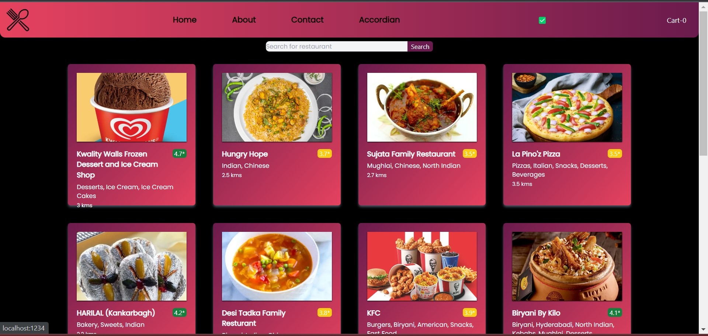
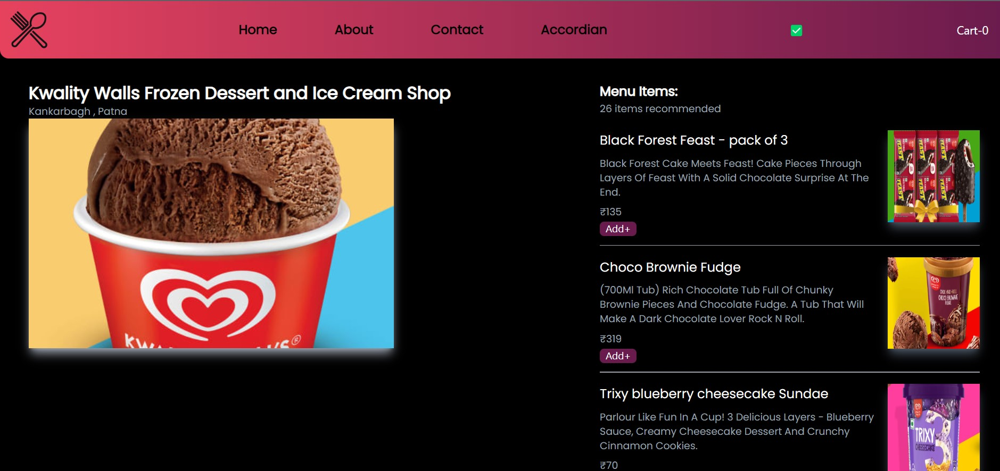
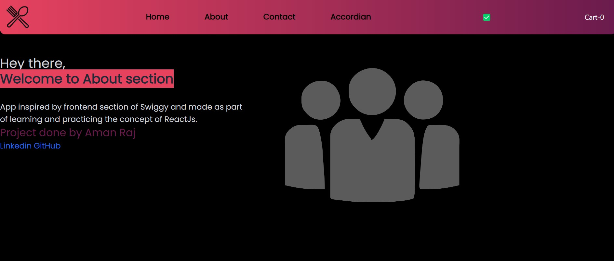
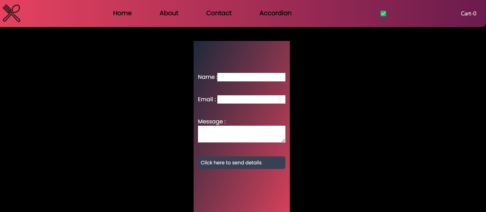
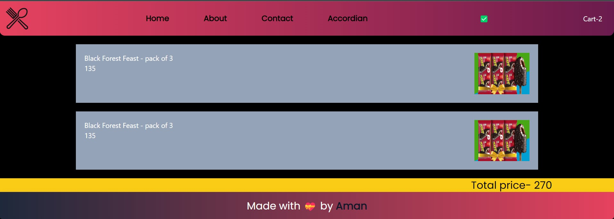

## Food App

- Using swiggy's public Api for getting restaurants and their menu details.
```
As the app is using swiggy's api so you can get cors error here in order to disable cors following chrome extension can be used.
```
[CorsAllow - Click here to Download the extension](https://chrome.google.com/webstore/detail/allow-cors-access-control/lhobafahddgcelffkeicbaginigeejlf?hl=en)

### Attaching snapshot for example of working ui
#### Home Page

#### Menu Page

#### About Page

#### Contact Page

#### Cart Page


## All used tools and Libraries
- VS Code
- ReactJs
- React Router
- Redux toolkit
- Hooks
- Tailwind CSS
- Parcel
- EmailJs
- Shimmer effect
- Fetch Api
- Allow Cors plugin
- Git and Github


[Live](https://foodtestapp.netlify.app/)
[GitHub](https://github.com/amaanraaz/foodapp)